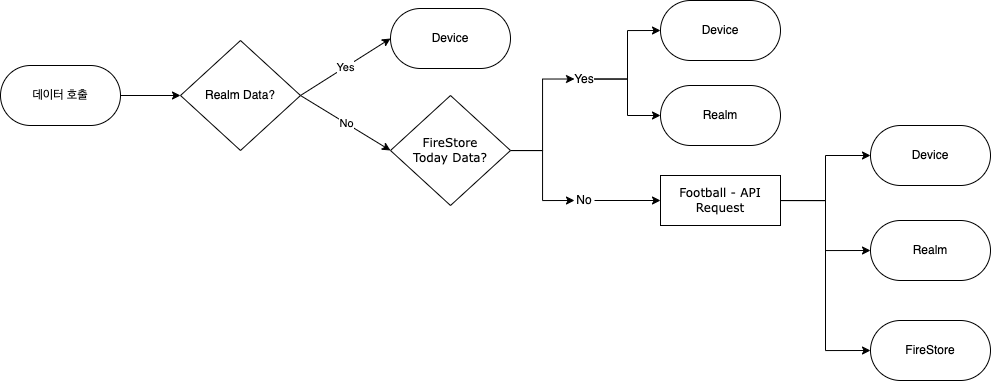

# SoccerInfo DevLog Day1

## 메인 탭바 컨트롤러 구성 (1시간 소요)
- Tabbar BackgroundColor가 Clear로 초기화 되어있어 제대로 생성되는지 몰랐다.
- StoryBoard Reference 이용. 탭바 아이템은 각 뷰의 스토리보드에서 만드는게 편하다. 코드로 작성시 매우 불편

## Standings 데이터 Codable 구조체 및 Realm 클래스 (2시간 소요)
- Codable과 Realm Object를 같이 사용하고 싶었으나 API Response에 이중 Array가 있는 등 매우 복잡하다.
- 깔끔하게 필요한 데이터만 모은 Realm Object 클래스를 만들어서 이용하기로 결정했다.
```swift
// Realm Data

class StandingsTable: Object {
    @Persisted(primaryKey: true) var id = ObjectId()
    @Persisted var data: List<StandingsRealmData>

    convenience init(data: List<StandingsRealmData>) {
        self.init()
        self.data = data
    }
}

class StandingsRealmData: Object {
    @Persisted var teamName: String
    @Persisted var teamLogo: String
    @Persisted var teamID: Int
    @Persisted var played: Int
    @Persisted var points: Int
    @Persisted var win: Int
    @Persisted var draw: Int
    @Persisted var lose: Int
    
    convenience init(standings: Standings) {
        self.init()
        self.teamName = standings.team.name
        self.teamLogo = standings.team.logo
        self.teamID = standings.team.id
        self.played = standings.all.played
        self.points = standings.points
        self.win = standings.all.win
        self.draw = standings.all.draw
        self.lose = standings.all.lose
    }
}
    

// Response By API
struct StandingData: Codable {
    var response: [StandingResponse]
}

struct StandingResponse: Codable {
    var league: StandingLeague
}

struct StandingLeague: Codable {
    var standings: [[Standings]]
}

struct Standings: Codable {
    var rank: Int
    var team: StandingTeam
    var points: Int
    var goalsDiff: Int
    var all: StandingStatus
}

struct StandingTeam: Codable {
    var id: Int
    var name: String
    var logo: String
}

struct StandingStatus: Codable {
    var played: Int
    var win: Int
    var draw: Int
    var lose: Int
}
```

## 데이터 로드 플로우차트
- Realm -> Firestore -> API 순으로 점검 후 로드 및 저장
- APIManager, RealmManager, FirestoreManager의 사용 순서를 위해 제작

