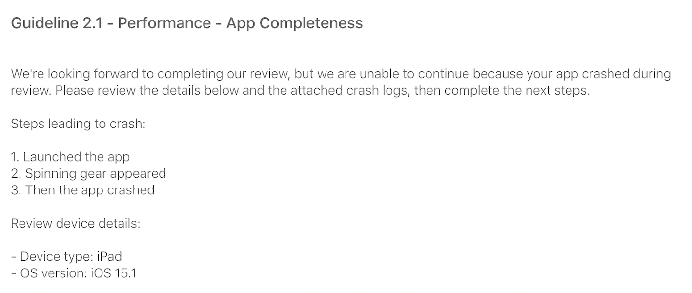
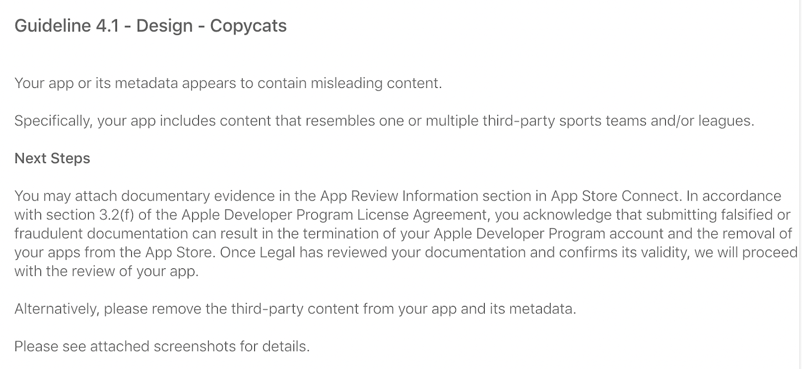
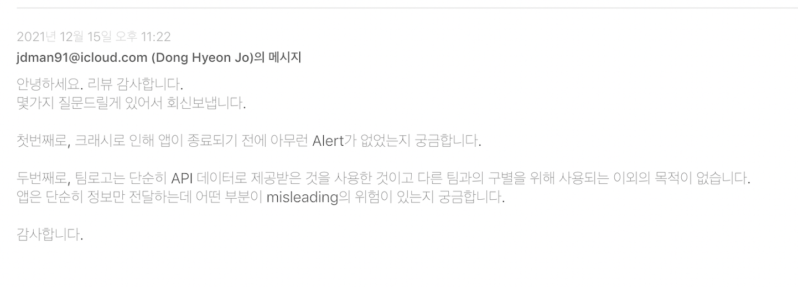
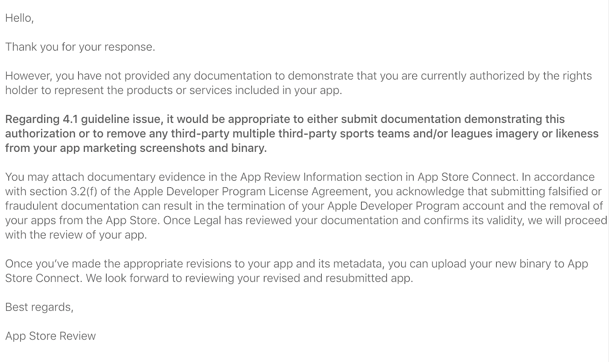
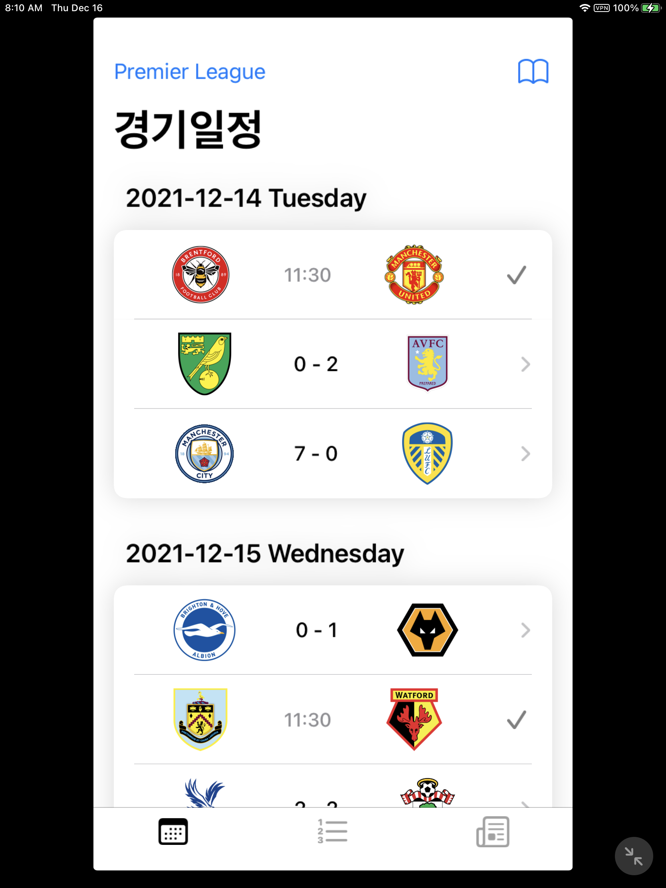
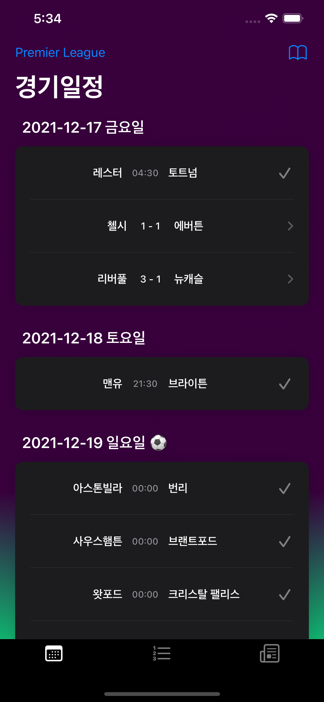
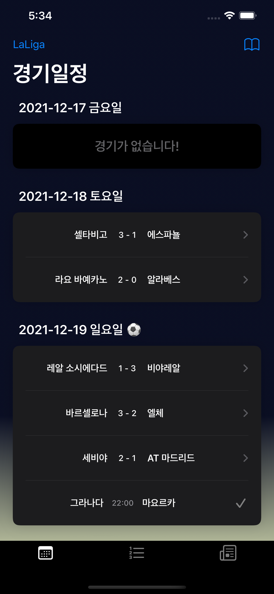

# DevLog Day 19 - 업데이트 거절 ~ 등록과정 정리

---
## 첫번째 업데이트 심사 거절
### 거절사유 1.

        
    

- 앱 실행시 ActivityView가 돌다가 앱이 크래시나고 종료된다고 하면서 App Completeness를 이유로 거절됐다.
- 출시때 이상이 없었는데 발생했다. 출시 전후로 변경된건 Timezone을 KST로 맞춘거라서 일단 모든 날짜를 KST 기준으로 변경했다.
- 그리고 에러를 던지는 모든곳에 Alert를 띄우도록 해놨다!!!
- 이 거절이유는 앞으로도 나를 계속 괴롭힌다.

### 거절사유 2.

        
    

- 우려했던 팀로고 문제가 출시 이후 업데이트에서 문제가 됐다...
- 이 부분에 대해서 첫번째 거절때는 아무런 대응을 하진 않았다.
- 개발중인 부분이 있었기 때문에 그 버전으로 올리고 또 거절맞으면 그떄 대응하려고 했다.

---
## 두번째 업데이트 심사 거절
- 놀랍게도 첫번째 업데이트 거절 사유와 동일했다!
- 앱이 실행안된다는 부분에서 굉장히 놀라고 사유를 도저히 못찾아서 엄청나게 괴로웠고 우울했다.

        
    

- 보내준 크래시 로그를 symbolcate한 결과 Backtrace 3번에 Invalid_Number_Of_Section이 찍혀있었다.
- 나는 테이블뷰에 초기값으로 7개의 데이터를 넣고, 7개의 count를 가진 데이터만 다루는데 진짜 이해할 수 없었다...
- 이거 때문에 2~3일 고민하면서 굉장히 우울했었다.
- 내가 테스트 했을때, 테스터분들도 제대로 되는데 왜 심사시에 그러는 걸까...
- 심지어 미국에 있는 친구한테도 테스트플라이트를 부탁했었는데 잘돌아갔다...
- 이 문제는 잠시 잊고 팀로고 사용에 대해서는 조언들은게 있어 한번 물어나보자하고 다음과 같은 회신을 보내게 됐다.

---
## 회신

        
    

- 위에서 에러를 던지는 모든곳에 Alert가 나오게 해놨다고 했는데 그 Alert 중 하나라도 나온게 있냐고 물어봤다.
- 그리고 팀로고에 대해서는API로 단지 소스만 제공받는 것일 뿐이다라는 취지의 문의도 넣었다.

---
## 회신의 회신

        
    

- 문의는 2일 후에 왔다. 생각보다 늦게왔다...
- API 사용에 대한 답은 없었다. 다 필요없고 너가 그걸 사용할 수 있다는 권리를 가진다는 문서나 제출해라 이런뜻인듯..
- 거절 사유로 저작권이 따로 있음에도 디자인 가이드라인으로 다루는건 스포츠팀에 관해서는 조금 더 특별히 다루는거라고 생각하게 만든다.
- 예전에 배웠던 권리소진이론도 생각나고 저작권 등은 피해갈 구석이 많나보다. 그래서 디자인으로 다루는듯

        
    

- 정말 어이없게도 내가 보낸 회신으로 받은 답장에 첨부한 스크린샷에서는 앱이 멀쩡하게 돌아가고 있었다!!
- 어이없으면서도 기쁜 기분. 하지만 뭐 때문에 그랬을까하는 호기심. 여러가지 감정이 섞여서 소용돌이쳤다.
- 수정한게 있다면 Realm Sync의 Schema에 long으로 된게 있었고 그걸 int로 수정하면서 sync를 재설정했었다.
- 만약 왜 해결됐냐고 물어본다면 이 부분을 대답해야할거 같다. 이미 제출한 빌드였고 코드를 수정할 수 없었으니까

---
## 디자인 수정 및 등록

        
     

- 로고 문제만 해결하면 됐고 빼기로 결정했기 때문에 디자인적으로 허전함을 가리기 위해 그라데이션을 넣었다.
- 각 리그를 상징하는 색을 사용했고 이거도 CopyCat이라고 거절될까봐 걱정했었다.
- 하지만 2021.12.18. 오후 11시에 심사 통과가 됐다는 메일이 왔고 스토어에 올라간걸 확인했다.
- 여기까지가 약 2주정도의 업데이트 시도와 거절, 그러나 결국 등록까지 했던 기록이다.