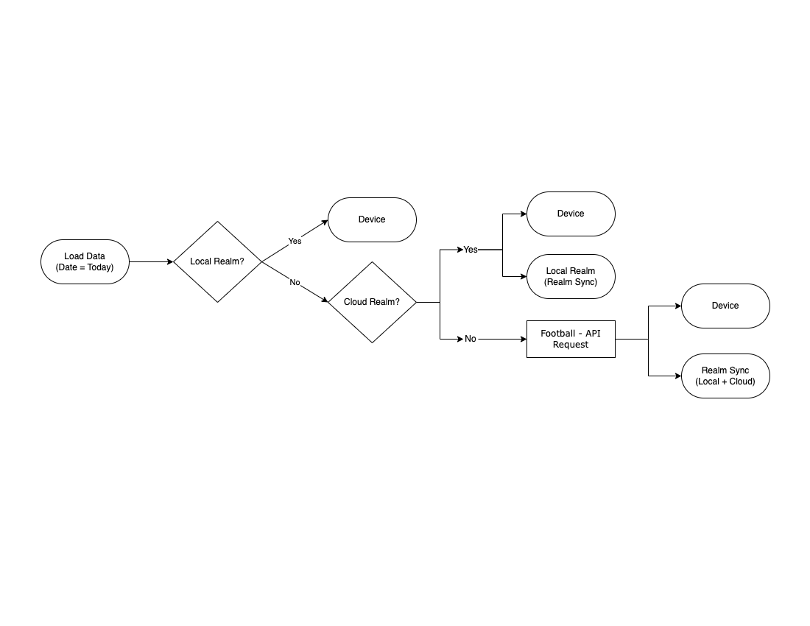

# SoccerInfo DevLog Day2

## Standings View Controller UI 제작(4시간)
- Storyboard 제작
- Navigation Controller 설정.
- 공수산정 : 2시간, 실제시간 : 4시간  
  => 헤더뷰를 섹션 헤더뷰로 변경. 순위, 팀명 등 Label간 간격 및 크기를 고려하느라 시간초과.

### 문제 및 해결
- 스토리보드로 만드니 Large title 사용시 sizeToFit 필요함  
    => 지저분해서 스토리보드에서 prefer large title 체크로 해결

- Tabbar Appearance를 iOS 15.0 버전 대응해야한다
``` swift
    if #available(iOS 15.0, *) {
        let tabbarAppearance = UITabBarAppearance()
        tabbarAppearance.configureWithOpaqueBackground()
        tabbarAppearance.backgroundColor = .systemBackground
        tabbarAppearance.selectionIndicatorTintColor = .label
        
        UITabBar.appearance().standardAppearance = tabbarAppearance
        UITabBar.appearance().scrollEdgeAppearance = tabbarAppearance
    }
    else {
        UITabBar.appearance().tintColor = .label
        UITabBar.appearance().backgroundColor = .systemBackground
    }
```

- 순위, 팀, 승점 등을 섹션 헤더뷰로 넣어 스크롤시에도 항목이 보이게 하는 편이 좋아보여서 수정  
  => 커스텀 뷰 제작. xib 파일 이용. Size: Freeform, Use Safe Area Layout Guides 체크 해제

``` swift
    func tableView(_ tableView: UITableView, viewForHeaderInSection section: Int) -> UIView? {
        let nib = Bundle.main.loadNibNamed(StandingSectionHeaderView.identifier, owner: self, options: nil)
        let headerView = nib?.first as! StandingSectionHeaderView
        return headerView
    }
```

---


## 순위 표시
- API call : json 파일로 테스트
- Local Realm: 로그인 된 user configuration을 이용해야 synced realm을 local로 사용 가능.
- Cloud Realm: asyncOpen 내에서 synced realm을 이용.
- 공수산정 : 2시간, 개발시간 : 4시간  
  => Realm sync 학습시간에 따른 시간 초과

### Realm Sync
- Firestore를 사용하는 것에서 Realm sync를 이용해 Cloud Realm과 연동하도록 변경.


### 문제 및 해결
- Synced Realm을 Local과 Cloud 구분해서 사용해야할 필요가 있었다.
- Cloud를 이용하는 경우 통신 시간이 있어 늦게 로딩되므로 유저 경험이 좋지 않다.
- Local Realm에 저장된 데이터가 최신이라면 Local을 사용해야한다.

```swift
    // fetch from Local Realm
    let user = app.currentUser!
    let config = user.configuration(partitionValue: "partitionValue")

    let localRealm = try! Realm(configuration: config)
    let realmData = try! localRealm.objects(StandingsTable.self).first!
    data = Array(realmData.standingData)

    // fetch from Cloud Realm
    Realm.asyncOpen(configuration: config) { result in
        switch result {
            case .success(let realm):
                let realmData = try! realm.objects(StandingsTable.self).first!
                self?.data = Array(standingData.standingData)                            
            case .failure(let error):
                print(error)
        }
    }    
```

---

## Realm User 문제
- Local이든 Cloud든 현재 기기에 로그인이 된 유저로부터 configuration을 가져와야 한다.
- 유저 데이터를 따로 저장하지 않기 때문에 익명 유저를 사용하려고 했었다.
- 하지만 익명 유저는 60일 지나면 expired 되고 기존 데이터에 접근하지 못한다.
- 그러면 이전에 저장된 Realm 파일을 삭제하는등 관리하기 힘드므로 UUID를 이용한 custom function user의 사용을 고려하고있다.
https://docs.mongodb.com/realm/sdk/ios/examples/users/authenticate-users/#custom-function-user  
=> UIDevice의 identifierForVender를 이용해 해결  
=> 앱 삭제 후 재설치시 새로운값을 사용하나 익명 유저를 사용하는거보다 안정적이다.

## fetchRealmData 함수(3시간)
- Generic을 사용해 하나의 함수로 여러 자료형에 적용
- 약간 길어지긴 했지만 Local Realm에 원하는 데이터가 없는 경우 Cloud Realm을 이용하는 것까지 구현
```swift
    func fetchRealmData<T: Object>(table: T.Type, league: Int, completion: @escaping (Result<T, Error>) -> Void ) {
        let app = App(id: APIComponents.realmAppID)
        if let user = app.currentUser {
            let configuration = user.configuration(partitionValue: "\(league)")
            do {
                // Local Realm Load
                let localRealm = try Realm(configuration: configuration)
                let objects = localRealm.objects(T.self)
                
                // Cloud Realm Load
                if objects.isEmpty {
                    Realm.asyncOpen(configuration: configuration) { result in
                        switch result {
                        case .success(let realm):
                            let syncedObjects = realm.objects(T.self)
                            completion(.success(syncedObjects.first!))
                            print("Cloud Realm Loaded")
                        case .failure(let error):
                            completion(.failure(error))
                        }
                    }
                }
                else {
                    completion(.success(objects.first!))
                    print("Local Realm loaded")
                }
                
            }
            catch {
                completion(.failure(error))
            }
        }        
    }    
```

### 어려웠던 부분
- 클래스의 type과 self에 대한 이해가 부족해 시간이 걸렸다.
- 함수를 정의할 때 매개변수 부분에 클래스의 type을 작성하고, 함수 호출시 전달인자로 self 전달한다.