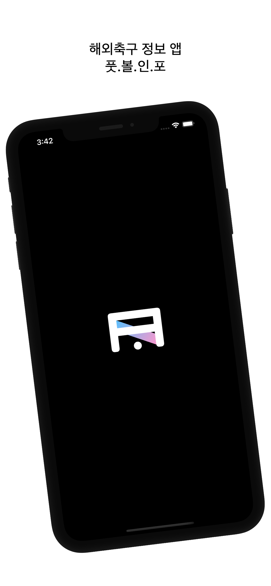

# 풋볼인포 - 해외축구 정보 앱

# Overview

<div align = "center">        
    
</div>


- [앱스토어 출시! (1.1.4 버전 업데이트)](https://apps.apple.com/kr/app/%ED%92%8B%EB%B3%BC%EC%9D%B8%ED%8F%AC/id1596846211)
- 해외축구 일정, 순위, 뉴스 확인
- 경기결과 확인
- 경기세부정보 확인 - 경기기록, 포메이션, 선발/후보 명단
- 5개 국가 리그 - 영국, 스페인, 독일, 프랑스, 이탈리아
- 최근 경기 성적 확인
- 경기 1시간 전 알림 설정
- 제작기간: 기획 1주, 개발 2주 ~ 출시 후 업데이트 중

---

# Video
<div align = "center">
    <a href = "https://youtu.be/6LX6KvW8E1E">
    </a>
</div>

---

# Framework, Library
- UIKit
- Alamofire(https://github.com/Alamofire/Alamofire)
- Kingfisher(https://github.com/onevcat/Kingfisher)
- Realm-cocoa(https://github.com/realm/realm-cocoa)
- SideMenu(https://github.com/jonkykong/SideMenu)
- Charts(https://github.com/danielgindi/Charts)
- Google Analytics, Crashlytics

---

# Project Plan

- [기획](./Plan&Log/Plan/README.md)

---

# Log
- [개발기록](./Plan&Log/DevLog)
- 1주차 영상(https://youtu.be/Pgfj12BiwP4)
- 2주차 1차 업데이트 제출 영상(https://youtu.be/SApj6SQNYGQ)
- 발표영상(https://youtu.be/SrqsYSq0zEI) 
- 최근성적 업데이트(https://youtu.be/m5k1IMv0aVA) 
- 팀로고 삭제 및 업데이트 스토어 등록(https://youtu.be/8--xFcSfQlc)
- 1.1.3 업데이트(https://youtu.be/6LX6KvW8E1E)
---

# Issues
### 1. Request/Day = 100
- 사용하려는 API의 하루 호출가능횟수가 너무 작아서 생긴 문제  
  => Realm Sync를 사용해 해결 [DataFlow](./Plan&Log/DevLog/Log_day2.md)
### 2. UpdateDate
- 매일 새벽 6시이후에 새로운 데이터를 업데이트 할 수 있도록 제작  
  => 같은날 자정 전. 다른날 새벽 6시 이전. 다른날 새벽 6시 이후. 3가지 케이스로 나눠서 업데이트.
  ```swift
    //Setting New Realm Update Date
    let now = Date()
    let currNewUpdateDate = table.updateDate // now 06:00 AM
    let prevUpdateDate = prevObject.updateDate

    // same day. prev update date start == newUpdateDate start.
    // update day become nextday 06:00
    if prevUpdateDate.dayStart == currNewUpdateDate.dayStart {
        prevObject.updateDate = currNewUpdateDate.nextDay.updateHour
        print("same day")
    }
    // other day now before update day 06:00 AM. now < currNewUpdateDate    
    else if now < currNewUpdateDate {
        prevObject.updateDate = currNewUpdateDate
        print("other day before 06:00")
    }
    // other day after 06:00 AM
    else if now >= currNewUpdateDate {
        prevObject.updateDate = currNewUpdateDate.nextDay.updateHour
        print("other day after 06:00")
    }                            
  ```
### 3. Timezone
- 출시지역은 대한민국 1개 지역이었으나 나올 수 없는 업데이트 시간이 나옴  
  => 모든 시간을 KST 기준으로 계산하도록 변경   
  [Calendar+Extension](./SoccerInfo/Extensions/Calendar+Extension.swift)  
  [Date+Extension](./SoccerInfo/Extensions/Date+Extension.swift.swift)

### 4. 네이버 뉴스 검색 API에 썸네일이 없음
- 랜덤으로 기사 5개를 뽑아 타이틀로 네이버 이미지 검색을 다시 진행
- DispatchGroup을 이용해 모든 데이터를 불러온 후 뷰에 표시
```swift
let group = DispatchGroup()
// News Search
fetchAPIData(of: .newsSearch, url: url) { [weak self] (result: SearchResponse) in
    switch result {
    case .success(let newsResponse):
        self?.totalPage = min(self!.totalPage, 100)
        var items = newsResponse.items
        if items.isEmpty { return }
        
        var randomIndex: Set<Int> = [0]
        let minCount = min(items.count, 5)
        while randomIndex.count < minCount {
            randomIndex.insert(Int.random(in: 0 ..< minCount))
        }
        
        // News Image Search by News title
        for i in randomIndex {
            group.enter()                    
            let query = URLQueryItem(name: "query", value: items[i].title!.removeSearchTag)
            let display = URLQueryItem(name: "display", value: "1")
            let sort = URLQueryItem(name: "sort", value: "sim")
            let url = APIComponents.newsRootURL.toURL(of: .newsImage,
                                                      queryItems: [query, display, sort])
            
            self?.fetchAPIData(of: .newsImage, url: url) { (result: SearchResponse) in
                switch result {
                case .success(let newsResponse):
                    if newsResponse.items.isEmpty == false {
                        items[i].imageURL = newsResponse.items[0].link
                    }
                    group.leave()
            // ...
```

### 5. Emoji to UIImage
- 축구공 이미지가 필요한데 웹에서 이미지를 받기 싫어서 Emoji를 사용  
  => Emoji는 문자열이라서 UIImage로 변환 [Emoji to UIImage](./Plan&Log/DevLog/Log_Day7.md)

### 6. arrow.left.arrow.right
- SF Symbol에 arrow.left.arrow.right는 있는데 그 반대는 없음...  
  => UIImage 회전으로 해결 [Rotate Image](./Plan&Log/DevLog/Log_Day7.md)

### 7. 문서와 다른 API Data
- 직접 데이터를 받아보니 API 제공처에서 만든 문서와 다른점이 많았다...
- 특히 교체 명단을 들어가는 선수와 나가는 선수를 반대로 주는 경우가 있었다.
- Realm에 저장시 자리를 바꿔서 들어가게 변경
```swift
eventsAPIData.response
    // 잘못된 데이터로 첫번째 map 부분이 추가
    // 선발명단에 포함되어 있는지 여부로 들어가는 선수 판단
    .map {                                
        if $0.type == "subst" {
            let inID = $0.player.id
            let outID = $0.assist.id ?? 0
            if homeStartID.contains(outID) || awayStartID.contains(outID) {
                return $0
            }
            else {
                let newPlayer = EventsPlayer(id: outID, name: $0.assist.name ?? "")
                let newAssist = EventsAssist(id: inID, name: $0.player.name)
                return EventsResponse(time: $0.time,
                                      team: $0.team,
                                      player: newPlayer,
                                      assist: newAssist,
                                      type: $0.type,
                                      detail: $0.detail)
            }
        }
        else {
            return $0
        }
    }
    .map {
        EventsRealmData(eventsResponse: $0)
    }
    .forEach { eventList.append($0) }
```

### 8. 업데이트 심사거절 ~ 통과 과정
- 정말 힘들었던 업데이트 과정.  
[과정 정리 기록](./Plan&Log/DevLog/Log_Day19.md)

---

# Features
### 1. API Request를 위한 Codable과 Generic Method
- 축구정보를 받아오기 위해 API 호출
- Codable 프로토콜을 채택한 구조체 사용
- 하나의 Generic Method를 모든 API 호출에 사용

```swift
func fetchAPIData<T: Codable>(of footBallData: FootballData, url: URL?, completion: @escaping (Result<T, APIErrorType>) -> Void) {
    guard let url = url else {
        print("url fail")
        return            
    }
    AF.request(url, method: .get, headers: footBallData.headers)
        .validate(statusCode: 200 ... 500)
        .responseJSON { [weak self] response in
            switch response.result {
            case .success(_):
                let statusCode = response.response?.statusCode ?? 500
                switch statusCode {
                case 429:
                    completion(.failure(.requestLimit))
                    self?.alertAPIError(statusCode: statusCode)
                case 499:
                    completion(.failure(.timeout))
                    self?.alertAPIError(statusCode: statusCode)
                case 500:
                    completion(.failure(.serverError))
                    self?.alertAPIError(statusCode: statusCode)
                default:
                    guard let data = response.data,
                          let decoded = try? JSONDecoder().decode(T.self, from: data) else {
                              print("decode fail")
                              return }
                    completion(.success(decoded))
                    print("API CALL")
                }
            case .failure(let error):
                self?.alertWithCheckButton(title: "데이터를 가져오는데 실패했습니다",
                                           message: "네트워크 연결 상태를 확인해주세요.",
                                           completion: nil)
                print(error)
            }
        }
}
```

### 2. 정보 저장을 위한 Realm과 Realm Sync
- 축구 정보에서 뷰에 필요한 부분을 Realm에 저장.
- MongoDB와 Realm Sync를 이용해 Cloud DB에 저장. 모든 유저가 축구 정보 공유
- RealmTable Protocol을 만들어 Generic Method 제작.

```swift
    // T is determined when ViewController declare typealias
    func fetchRealmData<T: RealmTable>(league: League, season: Int, completion: @escaping (Result<T, RealmErrorType>) -> Void ) {
        let app = App(id: APIComponents.realmAppID)
        guard let user = app.currentUser else {
            alertWithCheckButton(title: "서버 접속에 실패했습니다",
                                 message: "네트워크 연결 상태를 확인하고 다시 시도해주세요.",
                                 completion: nil)
            return            
        }
        let configuration = user.configuration(partitionValue: "\(league.leagueID)")
        do {
            // Local Realm Load
            print("Local Realm Load")
            let localRealm = try Realm(configuration: configuration)
            
            // check league, season, updateDate
            let objects = localRealm.objects(T.self).where {
                $0._partition == "\(league.leagueID)" &&
                $0.season == season &&
                $0.updateDate > Date()
            }
            if objects.isEmpty {
                // Cloud Realm Load
                print("Cloud Realm Load")
                Realm.asyncOpen(configuration: configuration) { [weak self] result in
                    switch result {
                    case .success(let realm):
                        let syncedObjects = realm.objects(T.self).where {
                            $0._partition == "\(league.leagueID)" &&
                            $0.season == season &&
                            $0.updateDate > Date()
                        }
                        if syncedObjects.isEmpty {
                            completion(.failure(.emptyData))
                        }                        
                        else {
                            completion(.success(syncedObjects.first!))
                        }
                        print("Cloud Realm Loaded")
                    case .failure(let error):
                        print("sync realm error", error)
                        completion(.failure(.asyncOpenFail))
                        self?.alertWithCheckButton(title: "Error Code : 1", message: "", completion: nil)
                    }
                }
            }
            else {
                completion(.success(objects.first!))
                print("Local Realm loaded")
            }
        }
        catch {
            print("realm fail", error)
            completion(.failure(.realmFail))
            alertWithCheckButton(title: "Error Code : 2", message: "", completion: nil)
        }
    }
```

### 3. 기본 뷰 컨트롤러 Superclass 제작 및 상속
- 프로젝트 일관성을 위해 탭의 뷰 컨트롤러 추상클래스 제작
- 뷰 컨트롤러마다 사용되는 data가 달라 Generic Class로 제작

```swift
class BasicTabViewController<T: BasicTabViewData>: UIViewController, UINavigationControllerDelegate, SideMenuNavigationControllerDelegate {
    
    var data: [T] = []
    var season: Int = 2021
    var activityView = UIActivityIndicatorView()
    
    var league: League = .premierLeague {
        didSet {
            fetchData()
        }
    }
    
    override func viewDidLoad() {
        super.viewDidLoad()
        viewConfig()
        sideButtonConfig()
        league = PublicPropertyManager.shared.league
    }
    
    func viewConfig() {
        view.backgroundColor = .systemBackground
        activityView = activityIndicator()
    }
    
    func sideButtonConfig() {
        // ...
    }
    
    @objc func sideButtonClicked() {
        // ...
    }
    
    // for sharing league value whole tab
    override func viewDidAppear(_ animated: Bool) {
        super.viewDidAppear(animated)
        // ...
    }
    
    // for sharing league value whole tab
    override func viewWillAppear(_ animated: Bool) {
        // ...
    }
    
    // change league
    func sideMenuWillDisappear(menu: SideMenuNavigationController, animated: Bool) {
        // ...
    }
    
    // abstract method for fetching data
    internal func fetchData() { }
}
```
### 4. DispatchGroup을 이용한 클라우드 접속처리
- 첫번째 viewDidLoad전에 클라우드에 접속할 필요가 있음
- AppDelegate에서 접속처리

```swift
// Synchronous Configure
    let group = DispatchGroup()
    let queue = DispatchQueue.global(qos: .userInitiated)
        
    group.enter()
    print("login start")
    queue.async {
        let app = App(id: APIComponents.realmAppID)
        if let currentUser = app.currentUser, currentUser.isLoggedIn {
            print("current user exist",currentUser.id)
            sleep(1)
            group.leave()
            return
        }
        else {
            app.login(credentials: .anonymous) { result in
                switch result {
                case .success(let user):
                    print("new anonymous", user.id)
                    group.leave()
                case .failure(let error):
                    print(error)
                    group.leave()
                }
            }
        }
    }
        
    // ...    
        
    // Wait until All Configure
    group.wait()
    print("AppDelegate end")
    return true
```

### 5. 공통 속성을 관리하는 싱글턴
- 싱글턴 패턴을 사용해 모든 탭에서 같아야하는 속성 관리
- 하나의 탭에서 리그가 변경되면 다른 탭으로 이동시 변경된 리그에 대한 정보 표시

```swift
final class PublicPropertyManager {
    private init() {}
    static let shared = PublicPropertyManager()
    
    var league: League = .premierLeague
    var season: Int = 2021
}
```
